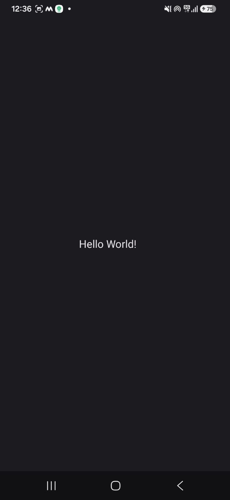
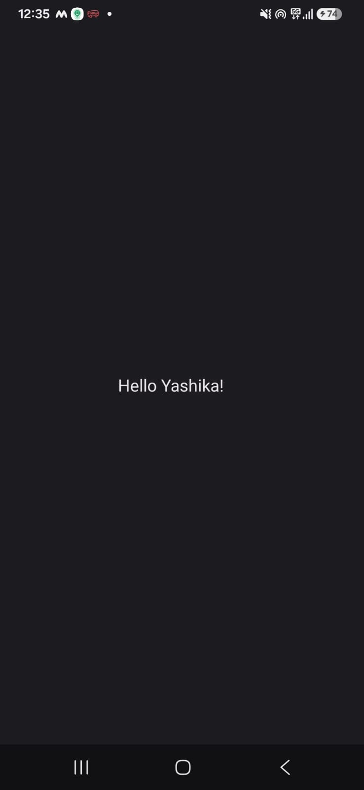
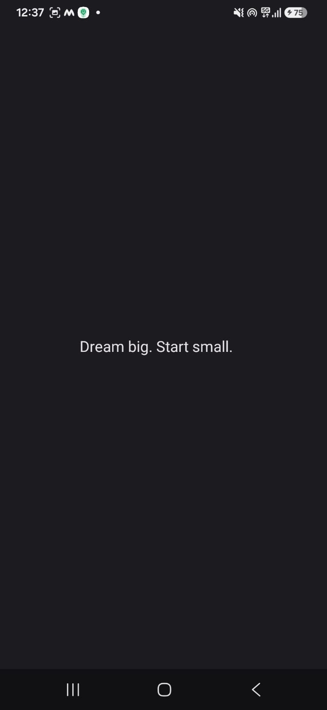

# Mobile Applications Lab

## Experiment 1

### Objective

To create a simple Android application that displays a motivational message using ConstraintLayout and TextView.

---

## Technology Used

- Android Studio
- Kotlin
- XML
- ConstraintLayout
- TextView

---

## Project Structure

```
Mobile-Applications/
│
├── app/
│   ├── src/
│   │   ├── main/
│   │   │   ├── java/
│   │   │   │   └── MainActivity.kt
│   │   │   ├── res/
│   │   │   │   └── layout/
│   │   │   │       └── activity_main.xml
│   │   │   └── AndroidManifest.xml
│
│   ├── testcase1.png
│   ├── testcase2.png
│   └── testcase3.png
│
└── README.md
```

---

## Application Output

![Output]

The application displays the text **"Dream big. Start small."** in the center of the screen using ConstraintLayout.

---

## Test Case 1

**Input:** Launch the application

**Expected Result:** Text appears in the center.

**Actual Result:** Passed 



---

## Test Case 2

**Input:** Run on Android Emulator

**Expected Result:** Application launches without errors.

**Actual Result:** Passed 



---

## Test Case 3

**Input:** Observe the displayed message.

**Expected Result:** "Dream big. Start small." is displayed.

**Actual Result:** Passed 



---

## Conclusion

This experiment demonstrates how to create a basic Android application using XML layouts and ConstraintLayout. It provides an introduction to Android UI development and view positioning.
